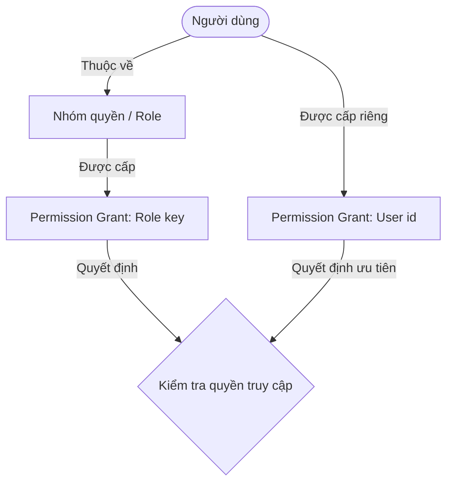
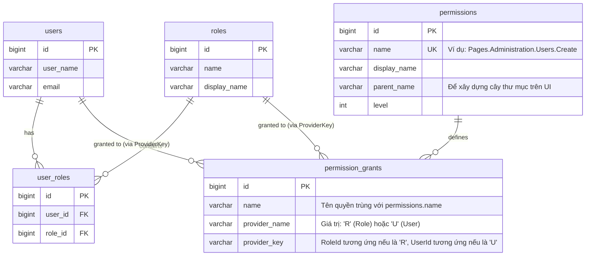

# Tài Liệu Thiết Kế Hệ Thống Phân Quyền (RBAC & PBAC Hybrid Model)
> **Cơ chế phân quyền lấy cảm hứng từ ABP Framework**

Tài liệu này mô tả chi tiết về mặt nghiệp vụ, cấu trúc dữ liệu, nguyên lý vận hành và hướng dẫn áp dụng hệ thống phân quyền kết hợp giữa **RBAC (Role-Based Access Control - Theo vai trò)** và **PBAC (Permission-Based Access Control - Theo quyền hạn chi tiết)** cho dự án.

---

## I. Phân Tích Nghiệp Vụ & Mô Hình Tổng Quan

Hệ thống phân quyền thông thường (RBAC thuần túy) chỉ cho phép kiểm tra vai trò của người dùng (Ví dụ: *Người dùng thuộc nhóm Admin hay nhóm Nhân viên*). Tuy nhiên, khi hệ thống phình to, nhu cầu phân quyền chi tiết phát sinh (Ví dụ: *Nhân viên A được xem báo cáo nhưng nhân viên B cùng phòng thì không*). Việc tạo thêm các nhóm vai trò mới sẽ dẫn đến hiện tượng bùng nổ số lượng vai trò khó kiểm soát.

Mô hình phân quyền **RBAC kết hợp PBAC** giải quyết bài toán này bằng cách:
1.  **Phân nhóm theo Vai trò (Role/Permission Group):** Quản lý quyền hạn số đông một cách nhanh chóng.
2.  **Định danh chi tiết theo Quyền hạn (Permission):** Kiểm tra quyền hạn trực tiếp trong code (Ví dụ: `Pages.Users.Create`, `Pages.Products.Delete`).
3.  **Cơ chế đè quyền (Override):** Cho phép gán trực tiếp một Quyền hạn cụ thể cho một User mà không cần thông qua Role.

### Sơ đồ nghiệp vụ phân cấp quyền (Cơ chế Kế thừa):



---

## II. Phân Tích Thực Thể Dữ Liệu (Database Schema)

Hệ thống phân quyền này vận hành dựa trên 5 bảng dữ liệu cốt lõi:



### Ý nghĩa của các bảng đặc thù:
*   **`permissions`**: Lưu thông tin cây thư mục quyền để hiển thị cấu hình trên giao diện quản trị (Admin Settings UI). Bảng này giúp Admin dễ dàng tích chọn cấp quyền.
*   **`permission_grants`**: Lưu trữ vết cấp quyền. Bảng này không liên kết khóa ngoại cứng với `users` hoặc `roles` mà dùng cơ chế **Polymorphic** (thông qua cặp `provider_name` và `provider_key`). Đây là chìa khóa giúp cấu trúc bảng gọn nhẹ nhưng cực kỳ linh hoạt.

---

## III. Nguyên Lý Vận Hành (How It Works)

Khi hệ thống nhận được một yêu cầu kiểm tra xem **"User X có quyền Y hay không?"** (Ví dụ khi User X click vào màn hình Sản phẩm hoặc gọi API sửa thông tin), luồng kiểm tra sẽ được thực hiện theo cơ chế ưu tiên giảm dần:

```
[Bắt đầu kiểm tra quyền Y của User X]
   |
   +---> Bước 1: Tìm trong bảng 'permission_grants' quyền Y trực tiếp cho User X
   |            (name = Y AND provider_name = 'U' AND provider_key = X.id)
   |            |
   |            +---> Thấy? ---> Trả về: ĐƯỢC PHÉP (Cho phép truy cập ngay lập tức)
   |
   +---> Không thấy? ---> Bước 2: Lấy danh sách các RoleIds của User X từ 'user_roles'
   |                              |
   |                              +---> Tìm trong 'permission_grants' quyền Y cho các RoleIds này
   |                                    (name = Y AND provider_name = 'R' AND provider_key IN (RoleIds))
   |                                    |
   |                                    +---> Thấy? ---> Trả về: ĐƯỢC PHÉP
   |
   +---> Tất cả đều không thấy? ---> Trả về: BỊ CẤM (Từ chối truy cập - 403 Forbidden)
```

---

## IV. Hướng Dẫn Sử Dụng & Áp Dụng Thực Tế

### 1. Định nghĩa mã quyền hạn (Code & DB)
Mã quyền hạn nên được định nghĩa dưới dạng chuỗi phân cấp ngăn cách bằng dấu chấm (Ví dụ: `Pages.Users.Create`).
*   **Tạo mới tính năng:** Nhà phát triển định nghĩa một mã quyền mới trong hằng số code (Ví dụ: `Pages.Products.Manage`).
*   **UI Quản lý:** Seed mã quyền mới này vào bảng `permissions` trong DB để Admin có thể thấy mục `Quản lý sản phẩm` trên giao diện cấu hình phân quyền.

### 2. Áp dụng bảo vệ tại Backend (NestJS)
Để bảo vệ các API, hệ thống sử dụng **Guards** và **Decorators** để chặn các request không hợp lệ ngay từ đầu cổng vào:

*   **Sử dụng Decorator:** Đặt trên mỗi hàm của Controller để chỉ định quyền yêu cầu.
    *   *Ví dụ:* `@CheckPermissions(Permissions.Users.Create)`
*   **Hoạt động của Guard:** Khi một API được gọi, Guard sẽ:
    1.  Trích xuất thông tin User từ JWT Token gửi lên.
    2.  Đọc mã quyền yêu cầu từ Decorator.
    3.  Gọi Service kiểm tra quyền (theo nguyên lý ở Mục III).
    4.  Nếu hợp lệ $\rightarrow$ Cho phép đi tiếp vào Controller. Nếu không $\rightarrow$ Trả về mã lỗi HTTP `403 Forbidden`.

### 3. Áp dụng tùy biến tại Frontend (React / Next.js)
Frontend nhận danh sách toàn bộ mã quyền của User hiện tại sau khi đăng nhập thành công.
*   **Điều hướng & Ẩn/Hiện Menu:**
    *   Mỗi menu item được gắn kèm một thuộc tính `requiredPermission`.
    *   FE chỉ hiển thị nút bấm hoặc đường dẫn menu nếu mã quyền của menu đó nằm trong danh sách quyền của User.
*   **Bảo vệ Trang (Route Guard):**
    *   Sử dụng Middleware hoặc Wrapper Component để bọc ngoài màn hình. Nếu User gõ thủ công đường dẫn URL mà không có quyền $\rightarrow$ Tự động chuyển hướng về trang `403 Forbidden`.

---

## V. Thiết Kế REST API Gán Quyền Dạng Cây

Để quản trị viên có thể xem và tích chọn cấp quyền theo dạng cây (Tree-view), hệ thống cung cấp các API sau:

### 1. Lấy toàn bộ cây Quyền hệ thống (Tree Structure)
*   **Endpoint:** `GET /api/v1/permissions/tree`
*   **Mô tả:** Trả về toàn bộ danh sách quyền khả dụng trong bảng `permissions` được tổ chức dạng cây thư mục cha - con.
*   **Ví dụ Response:**
    ```json
    {
      "success": true,
      "message": "Success",
      "data": [
        {
          "name": "Pages.Products",
          "displayName": "Quản lý sản phẩm",
          "level": 0,
          "children": [
            {
              "name": "Pages.Products.List",
              "displayName": "Xem danh sách",
              "level": 1,
              "children": []
            },
            {
              "name": "Pages.Products.Detail",
              "displayName": "Xem chi tiết",
              "level": 1,
              "children": []
            },
            {
              "name": "Pages.Products.Create",
              "displayName": "Thêm mới",
              "level": 1,
              "children": []
            }
          ]
        }
      ]
    }
    ```

### 2. Lấy danh sách Quyền đã được cấp (Grants)
*   **Endpoint:** `GET /api/v1/permissions/grants?providerName=R&providerKey=1`
*   **Query Params:**
    *   `providerName` (bắt buộc): `"R"` (Role) hoặc `"U"` (User)
    *   `providerKey` (bắt buộc): ID của Role hoặc ID của User
*   **Mô tả:** Trả về danh sách phẳng (Flat list) chứa các mã quyền hiện tại đang được cấp.
*   **Ví dụ Response:**
    ```json
    {
      "success": true,
      "message": "Success",
      "data": [
        "Pages.Products",
        "Pages.Products.List"
      ]
    }
    ```

### 3. Cập nhật quyền hạn (Save Grants)
*   **Endpoint:** `POST /api/v1/permissions/grant`
*   **Mô tả:** Cập nhật lại toàn bộ quyền hạn cho một Nhóm quyền (Role) hoặc User cụ thể.
*   **Ví dụ Request Body:**
    ```json
    {
      "providerName": "R",
      "providerKey": "1",
      "permissions": [
        "Pages.Products",
        "Pages.Products.List",
        "Pages.Products.Create"
      ]
    }
    ```
*   **Nguyên lý xử lý:** 
    1. Chạy trong một Database Transaction.
    2. Xóa sạch các quyền cũ trong bảng `permission_grants` ứng với `providerName` và `providerKey` tương ứng.
    3. Bulk Insert danh sách các quyền mới được truyền lên.

---

## VI. Giải Pháp Tối Ưu Hiệu Năng

Việc truy vấn dữ liệu từ bảng `permission_grants` nhiều lần cho mỗi API request sẽ tạo gánh nặng lớn cho Database khi lượng người dùng đồng thời (CCU) tăng cao. Để tối ưu:

1.  **JWT Claims (Đối với hệ thống vừa và nhỏ):**
    *   Nén danh sách mã quyền của User vào trong payload của JWT Token dưới dạng mảng chuỗi khi login.
    *   Mỗi request gửi lên, BE chỉ cần giải mã Token là có ngay danh sách quyền của User mà không cần truy vấn DB $\rightarrow$ Hiệu năng đạt tối đa.
2.  **Redis Cache (Đối với hệ thống lớn):**
    *   Lưu danh sách quyền của User vào Redis Cache với Key là `user:permissions:{userId}`.
    *   Khi có thay đổi quyền trong Admin UI, tiến hành xóa Cache tương ứng để User cập nhật quyền mới ở request tiếp theo.
3.  **LIKE Index:**
    *   Do thiết kế cấu trúc quyền dạng cha-con `Pages.Users.Create`, khi gán quyền cha `Pages.Users` cho một nhóm, ta có thể kiểm tra xem họ có quyền con không bằng truy vấn `LIKE 'Pages.Users%'` (không có dấu `%` ở đầu). Kiểu tìm kiếm này trong SQL Server vẫn tối ưu tốt bằng chỉ mục (Index Seek/Scan) thay vì tìm kiếm toàn văn gây chậm hệ thống.
